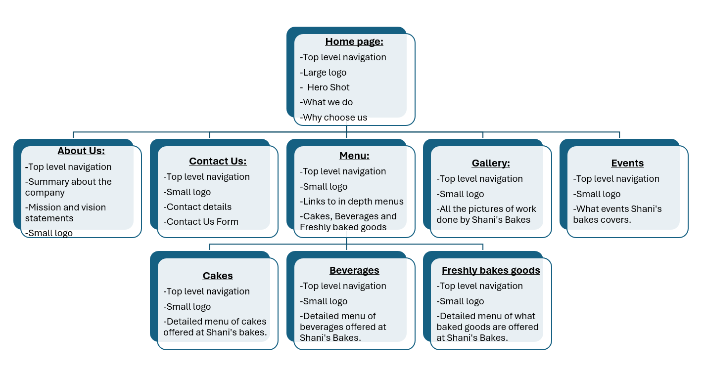
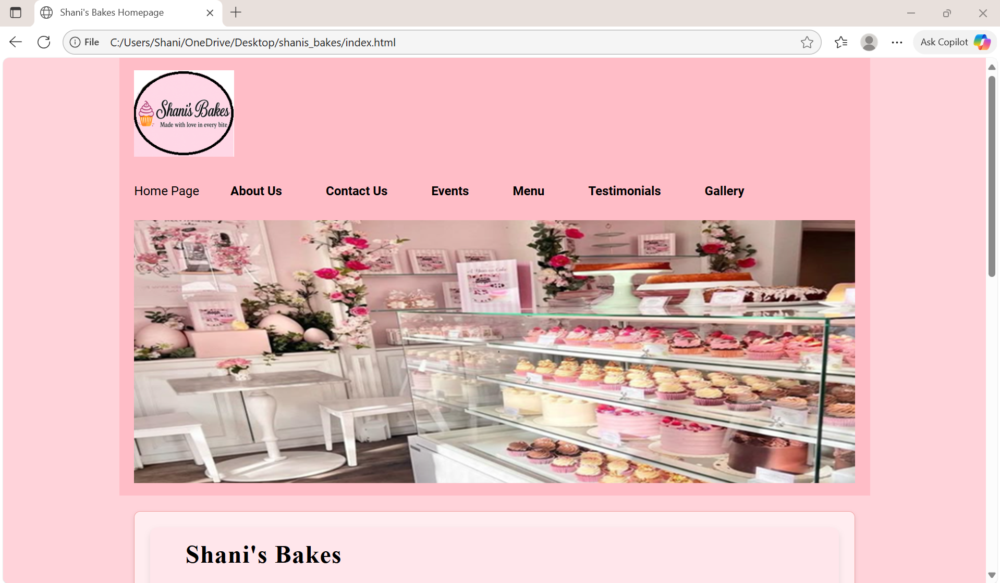
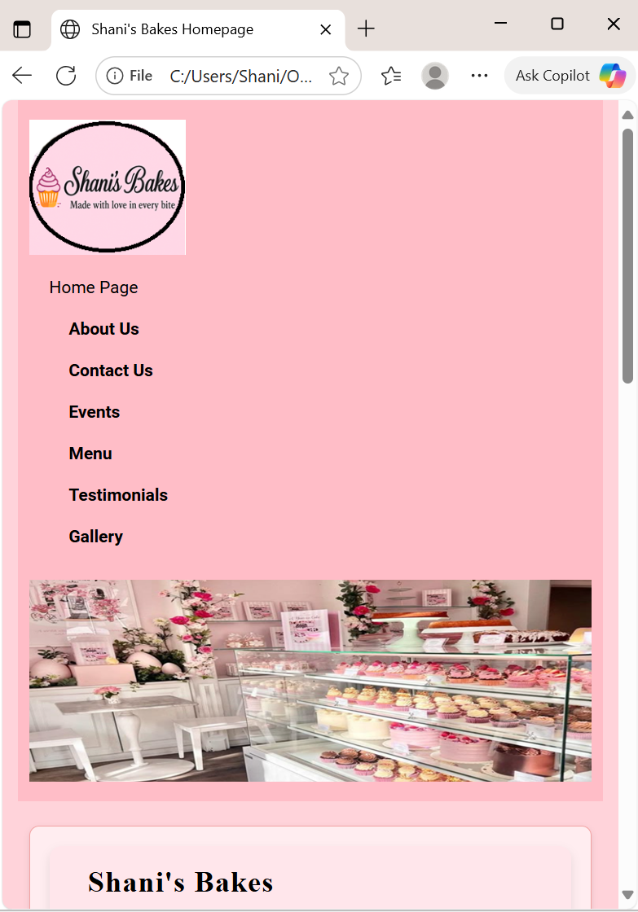
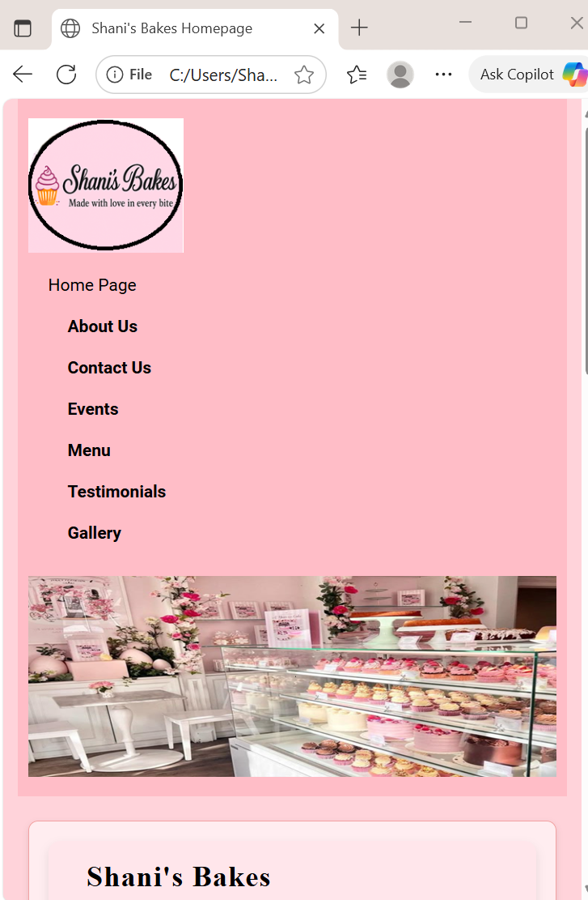

# 1. Project title 
Shani's Bakes Website Project.

## 2. Student Information 
Student name: Shania Chivani Kuni 
Student number: ST10498309
Group: 2 

## 3.Project overview 
The project involves creating a professional website for Shani’s Bakes, a small bakery business that specializes in freshly baked goods, custom cakes, and a variety of beverages. The website will serve as an online presence for the bakery, showcasing its products, services, and events while making it easier for customers to engage with the business.

Key pages will include a Home Page, About Us, Contact Us, and a Menu Section divided into cakes, baked goods, and beverages. Additional features such as a Gallery, Testimonials, and an Events Page will highlight past creations, customer feedback, and special offerings.

The aim of this project is to design a user-friendly, visually appealing website that reflects the creativity and quality of Shani’s Bakes, while enhancing customer experience and promoting the bakery’s brand identity.

## 4.Website Goals And Objectives
Goal 1:Increasing sales of baked goods.
Objective 1:Construct and establish an online store where clients can browse, purchase, and pay for pastries.

Goal 2: Display my own cake designs.
Objective 2: To draw in new clients, create a product gallery on the website that features images of personalized cakes along with descriptions.

Goal 3: Increase visibility and brand recognition.
Objective 3: To reach a larger audience, optimize the website for search engines (SEO) and integrate it with social media.

Goal 4: Increase client loyalty and involvement.
Objective 4: Include a newsletter registration and contact form to promote interaction and repeat business.

Goal 5: Boost in-store traffic.
Objective 5: Post information about the bakery's location, hours of operation, specials, and promotions on the website to entice customers to visit the actual store.

## 5.Key Features And Functionality
A welcome message and cakes featured on the home page. 
A page dedicated to our history and baking philosophy 
Menu page (special goods, cakes, cupcakes, and cookies) 
For custom orders, use the Order Request Form. 
Gallery of previous baked goods 
Contact page with embedded form Maps on Google

## 6.Timeline and Milestones 

August 18–21 (Week 3, August): Research and planning will be conducted to define objectives, identify target users, and outline the pages required.

August 22–23 (Week 4, August): Wireframes and layout designs will be finalized.

August 22–25 (Week 4, August): Content creation, including text, images, menus, and logos, will take place.

August 24–26 (Week 4, August): Part 1 of website development will be completed.

August 26–27 (Week 4, August): Part 1 testing and review will be conducted.

August 27 (Week 4, August): Part 1 submission will occur.

August 28–September 20 (Week 5, August – Week 3, September): Phase 2 of website development will take place.

August 28–September 23 (Week 5, August – Week 4, September): Content enhancement will continue during Phase 2.

September 24–28 (Week 4, September): Part 2 testing and final review will be conducted.

September 29 (Week 5, September): Part 2 submission and communication of the POE date will occur.

## 7.Sitemap 

## 8.Changelog 
#### Added 
About Us page with mission and vission statement 
Videos on the Cakes page and freshly baked goods page 
Three individual pages for the menu instead of one so that it is easier for the user to navigate and clearly see what they desire. 

#### Fixed 
Video not displaying, code was not formatted properly 
Navigation is the same no matter where I want to go,does not change when I click on something else, Error in code. 

#### Improvements from part 1:
##### Fixed 
1. File and folder structure
Feedback stated that I need to improve my naming of my html folders. 
-I changed the named of homepage.html to index.html. 
I also removed all the _page after each html file name. 
My navigation had the outdated names of the web pages so I corrected it. 
E.g. When i changed the homepage.html to index.html then my navigation was not functioning properly so I updated all the web pages names which linked it accordingly. 

##### Fixed
2. Goals and objectives:
Feedback stated that there is need to improve the goals and objectives of developing a website for a chosen business. 
My objectives need to be actionable as the objectives highlight what will be done to acheive the goals. 
-My goals were overall and vague. 
So I put it into a system by defining each goal seperately. 

##### Fixed 
3. Reference List 
Feedback stated that, there is a need to improve my reference list by including additional resources consulted in the preparation of the proposal. 
-I made a more in depth reference list including all resources used in preparation of the proposal. 

##### Fixed 
4. Comments. 
Feedback stated that there was a need to add comments 
-I added comments to my code to make it more readable.

##### Fixed 
5. HTML Structure and Basic Content. 
Feedback stated that there is need to improve the HTML structure and basic content across all web pages. 
-I improved the code layout and added the proper indents for readability.

##### Fixed 
6. Proposed website features and functionalities. 
Feedback stated that I should improve my proposed website features and functionalities that will appear across all five webpages. 
-I added a google form on the contact us page 

##### Fixed 
7. Timeline.
Feedback stated that each task should be further decomposed with a visible timeline for each milestone. 
-I updated my gantt chart to present my project timeline and milestones. 

##### Fixed 
8. Structure and Planning.
Feedback stated that my sitemap needed some improvements 
-I updated it accordingly. 

## 9. Images of responsiveness 

## 9.References 
Figma. (2025) Figma – Design, Prototype, and Collaborate. [online] 
Available at: https://www.figma.com
 [Accessed 27 Aug. 2025].

Google. (2025) Google Search. [online] 
Available at: https://www.google.com
 [Accessed 27 Aug. 2025].

OpenAI. (2025) ChatGPT. [online] 
Available at: https://chat.openai.com
 [Accessed 27 Aug. 2025].

Pexels. (2025) Free Stock Photos. [online] 
Available at: https://www.pexels.com
 [Accessed 27 Sep. 2025].

Pinterest. (2025) Pinterest – Explore Design and Web Inspiration. [online] 
Available at: https://www.pinterest.com
 [Accessed 27 Sep. 2025].

QuillBot. (2025) AI Paraphrasing Tool. [online] 
Available at: https://quillbot.com/paraphrasing-tool
 [Accessed 27 Sep. 2025].

W3Schools. (2025) Web Development Tutorials. [online] 
Available at: https://www.w3schools.com
 [Accessed 27 Sep. 2025].

YouTube. (2025) YouTube. [online] 
Available at: https://www.youtube.com
 [Accessed 27 Aug. 2025].

