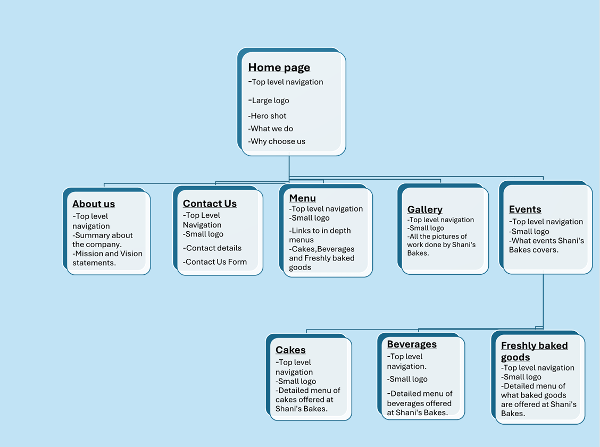

# 1. Project title 
Shani's Bakes Website Project.

## 2. Student Information 
Student name: Shania Chivani Kuni 
Student number: ST10498309
Group: 2 

## 3.Project overview 
The project involves creating a professional website for Shani’s Bakes, a small bakery business that specializes in freshly baked goods, custom cakes, and a variety of beverages. The website will serve as an online presence for the bakery, showcasing its products, services, and events while making it easier for customers to engage with the business.

Key pages will include a Home Page, About Us, Contact Us, and a Menu Section divided into cakes, baked goods, and beverages. Additional features such as a Gallery, Testimonials, and an Events Page will highlight past creations, customer feedback, and special offerings.

The aim of this project is to design a user-friendly, visually appealing website that reflects the creativity and quality of Shani’s Bakes, while enhancing customer experience and promoting the bakery’s brand identity.

## 4.Website Goals And Objectives
Create a brand identity and an online presence. 
Take online orders for personalized cakes and cupcakes. Display a menu and a gallery of previous works. 
Gain credibility and expand your social media following. 

## 5.Key Features And Functionality
A welcome message and cakes featured on the home page. 
A page dedicated to our history and baking philosophy 
Menu page (special goods, cakes, cupcakes, and cookies) 
For custom orders, use the Order Request Form. 
Gallery of previous baked goods 
Contact page with embedded form Maps on Google

## 6.Timeline and Milestones 

From August 18 to 21, 2025, the website project will begin with research and planning to establish objectives, target users, and pages.  From August 22 to 23, wireframes and layout design will be completed. From August 22 to 25, content creation—including text, photos, menus, and logos—will take place.  Part 1 of website development will take place from August 24 to 26. Part 1 of testing and review will take place from August 26 to 27. Part 1 submission will take place on August 27.

 The second phase of website development will run from August 28 to September 20. The second phase of content enhancement will run from August 28 to September 23.  September 24–28 is the date for Part 2 Testing and Final Review, and September 29 is the date for Part 2 Submission.  It is necessary to publicize the POE date.

## 7.Sitemap 

## 8.Changelog 
#### Added 
About Us page with mission and vission statement 
Videos on the Cakes page and freshly baked goods page 
Three individual pages for the menu instead of one so that it is easier for the user to navigate and clearly see what they desire. 

#### Fixed 
Video not displaying, code was not formatted properly 
Navigation is the same no matter where I want to go,does not change when I click on something else, Error in code. 

## 9.References 
Google. (2025) Google Search. 
Available at: https://www.google.com 
(Accessed: 27 August 2025).

OpenAI. (2025) ChatGPT. 
Available at: https://chat.openai.com 
(Accessed: 27 August 2025).

Figma. (2025) Figma – Design, Prototype, and Collaborate. 
Available at: https://www.figma.com 
(Accessed: 27 August 2025).

YouTube. (2025) YouTube. 
Available at: https://www.youtube.com 
(Accessed: 27 August 2025).

